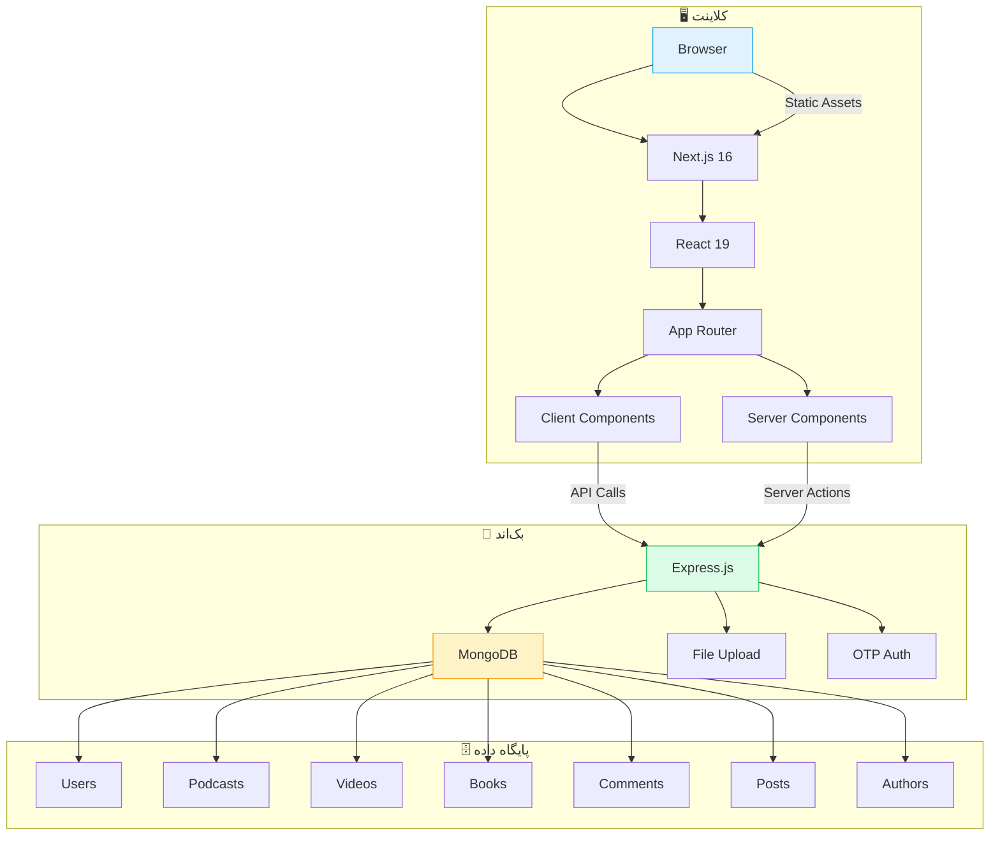
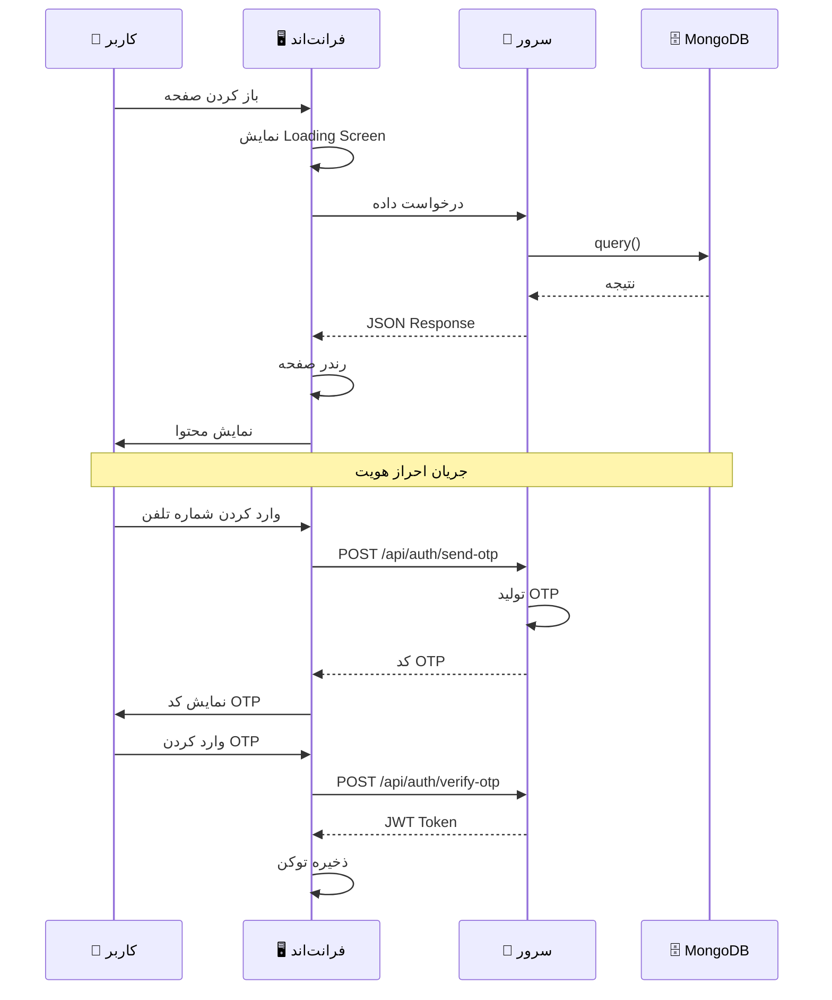
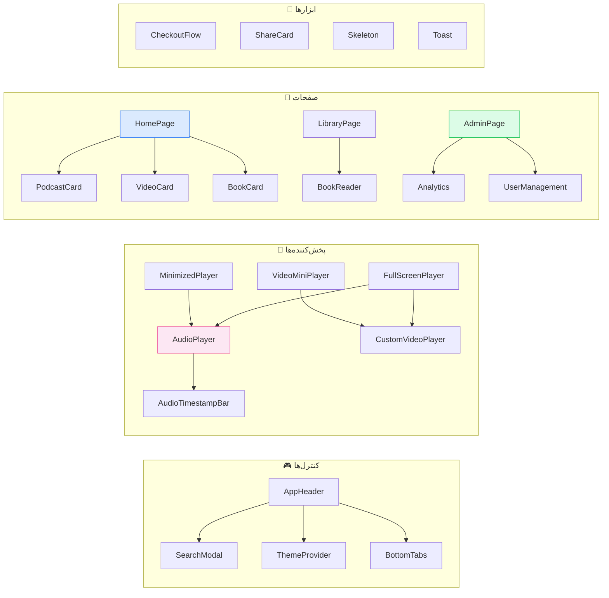
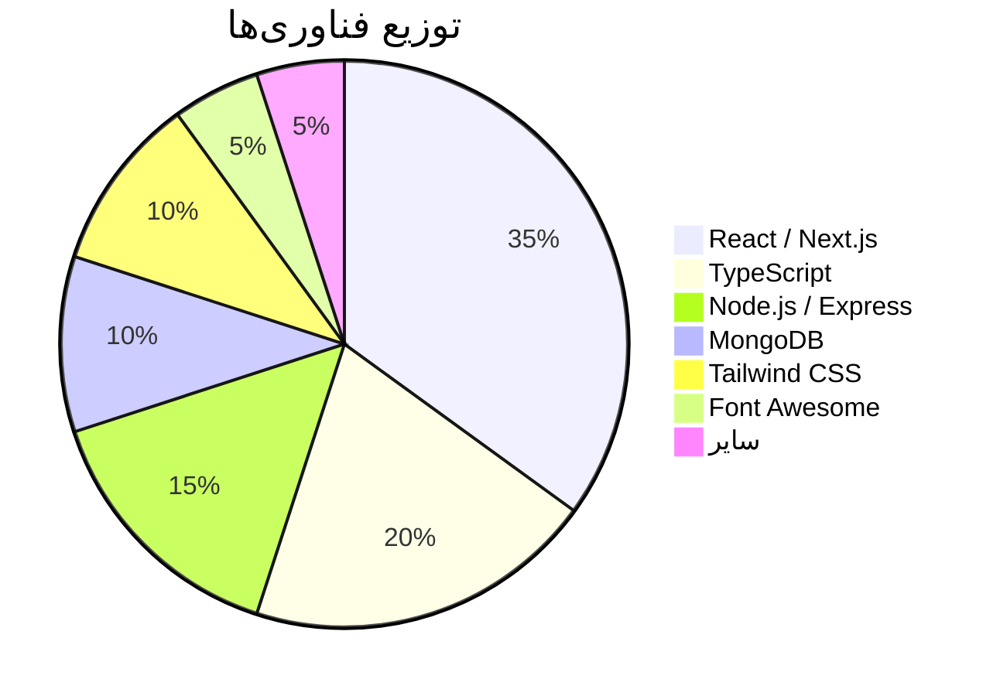

<p align="center">
  
</p>

<h1 align="center">محفل — MAHFEL</h1>

<p align="center">
  پلتفرم جامع پادکست، ویدیو و کتاب صوتی با رابط کاربری RTL فارسی
</p>

<p align="center">
  <a href="#-قابلیت‌ها">قابلیت‌ها</a> •
  <a href="#-معماری">معماری</a> •
  <a href="#-ساختار-پروژه">ساختار پروژه</a> •
  <a href="#-نصب-و-راه‌اندازی">نصب و راه‌اندازی</a> •
  <a href="#-فناوری‌ها">فناوری‌ها</a> •
  <a href="#-اسکرین‌شات‌ها">اسکرین‌شات‌ها</a>
</p>

<p align="center">
  
  
  
  
  
  
</p>

---

## 🎯 قابلیت‌ها

<table>
<tr>
<td width="50%">

### 🎧 پادکست و صدا
- پخش‌کننده صوتی پیشرفته با زمان‌بندی
- پخش‌کننده صوتی کوچک (Mini Player)
- پخش‌کننده تمام‌صفحه
- لیست پخش (Playlist)
- جامعه نظرات پادکست
- آپلود فایل‌های صوتی

</td>
<td width="50%">

### 🎬 ویدیو
- پخش‌کننده ویدیویی سفارشی
- پخش آنلاین YouTube با Embed
- پخش‌کننده ویدیویی کوچک
- لیست ویدیوها با فیلتر
- پخش تمام‌صفحه
- جامعه نظرات ویدیو

</td>
</tr>
<tr>
<td width="50%">

### 📚 کتاب
- خواننده PDF داخلی (PDF.js)
- خواننده فایل‌های متنی (Mammoth.js)
- کتاب‌های منتشر شده
- علاقه‌مندی‌ها و بوکمارک
- جستجوی پیشرفته
- سبد خرید و پرداخت

</td>
<td width="50%">

### 👤 پروفایل و مدیریت
- ورود با OTP (رمز یکبار مصرف)
- پروفایل کاربری با آواتار
- مدیریت علاقه‌مندی‌ها
- سفارشات و تاریخچه
- پنل مدیریت (Admin Panel)
- جستجوی جهانی

</td>
</tr>
</table>

---

## 🏗️ معماری

### نمودار کلی سیستم



---

### نمودار جریان داده‌ها



---

### نمودار کامپوننت‌ها



---

## 📁 ساختار پروژه

```
MAHFEL/
├── app/                          # Next.js App Router
│   ├── (auth)/                   # گروه مسیر احراز هویت
│   │   └── layout.tsx
│   ├── api/                      # API Routes
│   │   ├── health/route.ts       # Health Check
│   │   └── search/route.ts       # جستجوی پروکسی
│   ├── actions.ts                # Server Actions
│   ├── globals.css               # استایل‌های سراسری
│   ├── layout.tsx                # لایوت ریشه (فونت‌ها، متادیتا)
│   ├── loading.tsx               # صفحه لودینگ سفارشی
│   ├── not-found.tsx             # صفحه 404
│   ├── page.tsx                  # ورودی اصلی (SPA)
│   ├── robots.txt                # فایل robots
│   └── sitemap.ts                # نقشه سایت
│
├── components/                   # کامپوننت‌های React
│   ├── AudioPlayer.tsx           # پخش‌کننده صوتی
│   ├── AudioTimestampBar.tsx     # نوار زمان‌بندی صدا
│   ├── BookCard.tsx              # کارت نمایش کتاب
│   ├── BookReader.tsx            # خواننده کتاب
│   ├── CartModal.tsx             # مodal سبد خرید
│   ├── CheckoutFlow.tsx          # فرآیند پرداخت
│   ├── CustomVideoPlayer.tsx     # پخش‌کننده ویدیویی
│   ├── ExternalScripts.tsx       # اسکریپت‌های خارجی
│   ├── FullScreenPlayer.tsx      # پخش تمام‌صفحه
│   ├── InlineVideoPlayer.tsx     # پخش ویدیویی Inline
│   ├── LiveBanner.tsx            # بنر زنده
│   ├── MahfelSidebar.tsx        # سایدبار محفل
│   ├── MinimizedPlayer.tsx       # پخش‌کننده کوچک
│   ├── OptimizedImage.tsx        # تصویر بهینه‌شده
│   ├── PdfViewer.tsx             # نمایشگر PDF
│   ├── PodcastCard.tsx           # کارت پادکست
│   ├── SearchModal.tsx           # مodal جستجو
│   ├── Sidebar.tsx               # سایدبار
│   ├── SohaLogo.tsx              # لوگوی سها
│   ├── StructuredData.tsx        # داده‌های ساختاریافته
│   ├── VideoCard.tsx             # کارت ویدیو
│   └── VideoMiniPlayer.tsx       # پخش‌کننده ویدیویی کوچک
│
├── views/                        # صفحات (جایگزین pages/)
│   ├── AdminPage.tsx             # پنل مدیریت
│   ├── AuthorPage.tsx            # صفحه نویسنده
│   ├── BookPage.tsx              # صفحه کتاب
│   ├── CommentsCommunityPage.tsx # جامعه نظرات
│   ├── FavoritesPage.tsx         # علاقه‌مندی‌ها
│   ├── HomePage.tsx              # صفحه اصلی
│   ├── InterestsPage.tsx         # علاقه‌مندی‌ها
│   ├── LibraryPage.tsx           # کتابخانه
│   ├── LoginPage.tsx             # صفحه ورود
│   ├── MatnPage.tsx              # صفحه متن
│   ├── NashrPage.tsx             # صفحه نشر
│   ├── OrdersPage.tsx            # سفارشات
│   ├── PlaylistPage.tsx          # لیست پخش
│   ├── PostCommentsPage.tsx      # نظرات پست
│   ├── PublishedBooksPage.tsx    # کتاب‌های منتشر شده
│   ├── SecretaryPage.tsx         # صفحه دبیرخانه
│   ├── SowtPage.tsx              # صفحه صوت
│   ├── UserProfilePage.tsx       # پروفایل کاربر
│   ├── VideoListPage.tsx         # لیست ویدیوها
│   └── VideoPlayerPage.tsx       # پخش ویدیو
│
├── server/                       # بک‌اند Express.js
│   ├── config/
│   │   └── db.js                 # اتصال MongoDB
│   ├── middleware/
│   │   └── auth.js               # مiddleware احراز هویت
│   ├── models/                   # مدل‌های Mongoose
│   │   ├── Author.js             # نویسنده
│   │   ├── Book.js               # کتاب
│   │   ├── Comment.js            # نظر
│   │   ├── Podcast.js            # پادکست
│   │   ├── Post.js               # پست
│   │   ├── PublishedBook.js      # کتاب منتشر شده
│   │   ├── User.js               # کاربر
│   │   └── Video.js              # ویدیو
│   ├── routes/                   # مسیرهای API
│   │   ├── admin.js              # پنل مدیریت
│   │   ├── auth.js               # احراز هویت
│   │   ├── authors.js            # نویسندگان
│   │   ├── books.js              # کتاب‌ها
│   │   ├── comments.js           # نظرات
│   │   ├── podcasts.js           # پادکست‌ها
│   │   ├── posts.js              # پست‌ها
│   │   ├── proxy.js              # پروکسی
│   │   ├── publishedBooks.js     # کتاب‌های منتشر شده
│   │   ├── upload.js             # آپلود فایل
│   │   └── videos.js             # ویدیوها
│   ├── uploads/                  # فایل‌های آپلود شده
│   └── server.js                 # نقطه ورود سرور
│
├── services/                     # سرویس‌های API
│   └── api.ts                    # توابع API فرانت‌اند
│
├── public/                       # فایل‌های استاتیک
│   ├── font-awesome/             # آیکون‌های Font Awesome
│   ├── fonts/                    # فونت‌های سفارشی
│   └── logo.jpg                  # لوگوی محفل
│
├── fonts/                        # فونت‌ها (برای next/font)
│   ├── IranNastaliq.ttf
│   └── IranNastaliq.woff2
│
├── next.config.ts                # تنظیمات Next.js
├── tailwind.config.js            # تنظیمات Tailwind CSS
├── tsconfig.json                 # تنظیمات TypeScript
└── package.json                  # وابستگی‌ها
```

---

## 🛠️ نصب و راه‌اندازی

### پیش‌نیازها

- Node.js 20+ 
- MongoDB 7+
- npm یا yarn

### مراحل نصب

```bash
# 1. کلون کردن پروژه
git clone https://github.com/emadch82/MAHFEL.git
cd MAHFEL

# 2. نصب وابستگی‌های فرانت‌اند
npm install

# 3. نصب وابستگی‌های بک‌اند
cd server
npm install
cd ..

# 4. تنظیم متغیرهای محیطی
cp .env.example .env
# ویرایش فایل .env با تنظیمات خودتان

# 5. اجرای MongoDB
mongod

# 6. اجرای سرور بک‌اند
cd server
node server.js

# 7. اجرای فرانت‌اند (در ترمینال جداگانه)
npm run dev
```

### متغیرهای محیطی

```env
# فرانت‌اند
VITE_API_URL=http://localhost:5000

# بک‌اند
PORT=5000
MONGODB_URI=mongodb://localhost:27017/soha
JWT_SECRET=your_jwt_secret_here
ADMIN_SECURITY_KEY=admin123
```

### دستورات

| دستور | توضیح |
|-------|-------|
| `npm run dev` | اجرای فرانت‌اند با Turbopack |
| `npm run build` | بیلد پروژه |
| `npm start` | اجرای پروژه بیلد شده |
| `cd server && node server.js` | اجرای سرور بک‌اند |

---

## 📊 نمودار فناوری‌ها



---

## 🔐 امنیت

<table>
<tr>
<td width="50%">

### فرانت‌اند
- CSP Headers (Content Security Policy)
- X-Content-Type-Options
- X-Frame-Options
- X-XSS-Protection
- Permissions-Policy
- Referrer-Policy

</td>
<td width="50%">

### بک‌اند
- JWT Authentication
- OTP Verification
- Rate Limiting
- Input Validation
- CORS Configuration
- Helmet.js

</td>
</tr>
</table>

---

## ⚡ عملکرد

| ویژگی | وضعیت |
|--------|-------|
| SSR (Server-Side Rendering) | ✅ با Next.js 16 |
| Streaming | ✅ Suspense + Loading |
| Image Optimization | ✅ next/image |
| Font Optimization | ✅ next/font |
| Script Optimization | ✅ next/script |
| Code Splitting | ✅ اتوماتیک |
| Caching | ✅ Static + Dynamic |
| PWA Support | ✅ manifest.json |

---

## 📱 صفحات و قابلیت‌ها

```mermaid
graph TD
    A[🏠 صفحه اصلی] --> B[🎵 پادکست‌ها]
    A --> C[🎬 ویدیوها]
    A --> D[📚 کتاب‌ها]
    A --> E[📝 پست‌ها]
    
    B --> B1[🎧 پخش صوتی]
    B --> B2[💬 جامعه نظرات]
    B --> B3[📋 لیست پخش]
    
    C --> C1[▶️ پخش ویدیو]
    C --> C2[💬 جامعه نظرات]
    C --> C3[📺 لیست ویدیوها]
    
    D --> D1[📖 خواندن PDF]
    D --> D2[📝 خواندن متن]
    D --> D3[🛒 سبد خرید]
    
    E --> E1[👍 لایک]
    E --> E2[💬 نظر]
    E --> E3[🔗 اشتراک‌گذاری]
    
    F[👤 پروفایل] --> G[❤️ علاقه‌مندی‌ها]
    F --> H[📦 سفارشات]
    F --> I[⚙️ تنظیمات]
    
    J[🔧 پنل مدیریت] --> K[📊 آمار]
    J --> L[👥 مدیریت کاربران]
    J --> M[📝 مدیریت محتوا]
    J --> N[🔍 جستجوی جهانی]
    
    style A fill:#dbeafe,stroke:#3b82f6
    style F fill:#fce7f3,stroke:#ec4899
    style J fill:#dcfce7,stroke:#22c55e
```



---

## 🌐 API Endpoints

| متد | مسیر | توضیح |
|-----|------|-------|
| `GET` | `/api/health` | Health Check |
| `GET` | `/api/search` | جستجوی محتوا |
| `POST` | `/api/auth/send-otp` | ارسال OTP |
| `POST` | `/api/auth/verify-otp` | تأیید OTP |
| `GET` | `/api/podcasts` | لیست پادکست‌ها |
| `GET` | `/api/videos` | لیست ویدیوها |
| `GET` | `/api/books` | لیست کتاب‌ها |
| `GET` | `/api/comments` | لیست نظرات |
| `POST` | `/api/upload` | آپلود فایل |
| `GET` | `/api/admin/stats` | آمار پنل مدیریت |
| `GET` | `/api/admin/users` | لیست کاربران |
| `GET` | `/api/admin/posts` | لیست پست‌ها |
| `GET` | `/api/admin/comments` | لیست نظرات |

---

## 🤝 مشارکت

1. Fork کنید
2. Branch جدید بسازید (`git checkout -b feature/amazing-feature`)
3. تغییرات را اعمال کنید (`git commit -m 'Add amazing feature'`)
4. Push کنید (`git push origin feature/amazing-feature`)
5. Pull Request ایجاد کنید

---

## 📄 مجوز

این پروژه تحت مجوز MIT است. فایل [LICENSE](LICENSE) را ببینید.

---

<p align="center">
  ساخته شده با ❤️ توسط <a href="https://github.com/emadch82">Emad</a>
</p>
