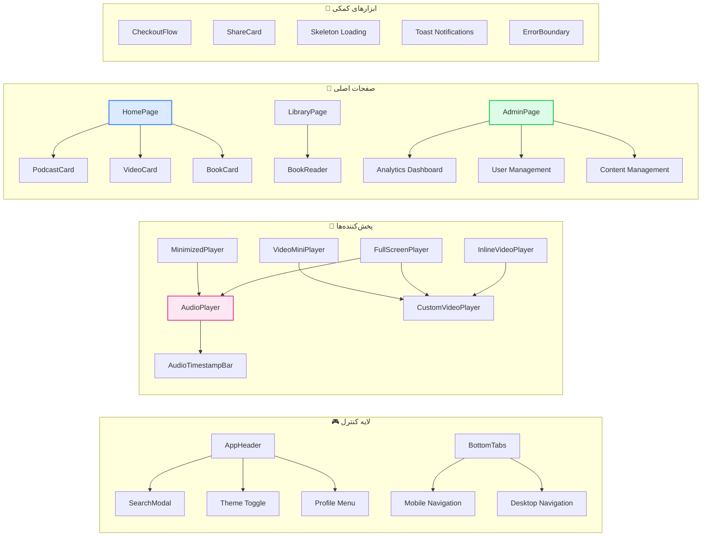
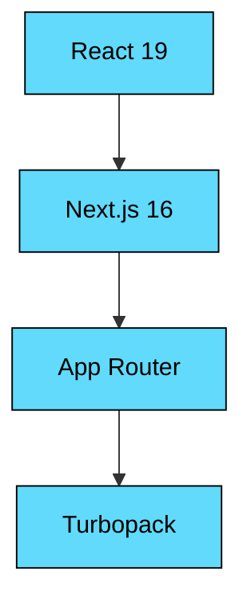
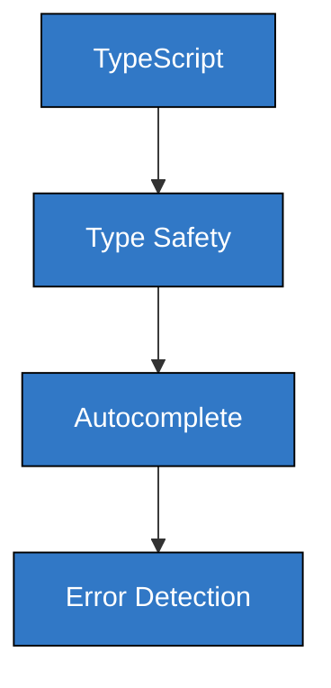
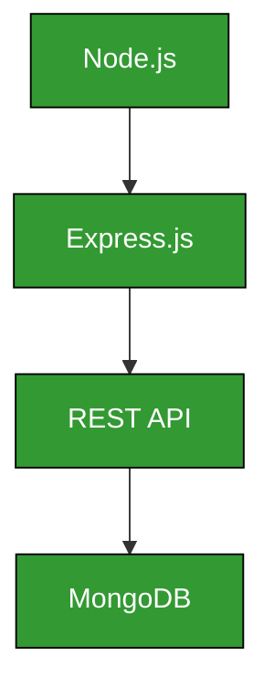
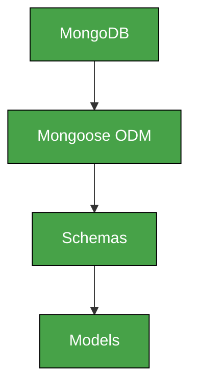
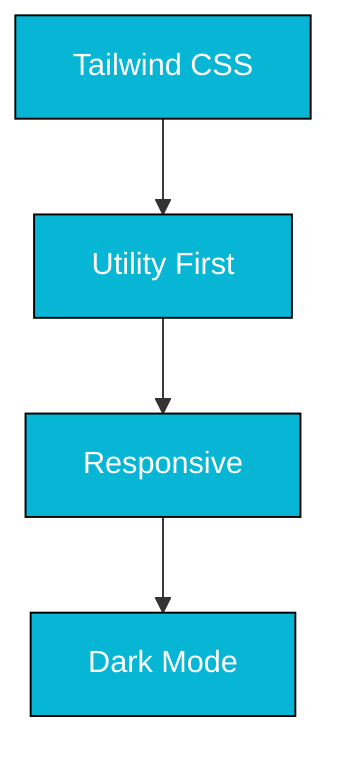
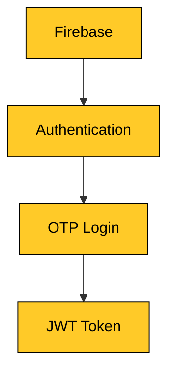

<div align="center">


# محفل — MAHFEL

### پلتفرم جامع محتوای دیجیتال

<br>

<a href="https://github.com/emadch82/MAHFEL">
  
  
  
  
  
  
  
  
</a>

<br>

<a href="#-ویژگی‌های-کلیدی">ویژگی‌ها</a> •
<a href="#-معماری-سیستم">معماری</a> •
<a href="#-ساختار-پروژه">ساختار پروژه</a> •
<a href="#-نصب-و-راه‌اندازی">نصب و راه‌اندازی</a> •
<a href="#-رابط-کاربری">رابط کاربری</a> •
<a href="#-امنیت">امنیت</a>

<br><br>

</div>

---

## ویژگی‌های کلیدی

<table>
<tr>
<td width="50%">

### 🎧 پادکست و صدا
> پخش‌کننده صوتی پیشرفته با قابلیت زمان‌بندی، پخش در پس‌زمینه و لیست پخش سفارشی

- پخش‌کننده صوتی کامل با کنترل‌های پیشرفته
- پخش‌کننده کوچک (Mini Player) در پایین صفحه
- پخش تمام‌صفحه برای تجربه بهتر
- لیست پخش (Playlist) با مدیریت آسان
- جامعه نظرات و تعامل کاربران
- آپلود و مدیریت فایل‌های صوتی

</td>
<td width="50%">

### 🎬 ویدیو
> پخش‌کننده ویدیویی سفارشی با پشتیبانی از YouTube و پخش آنلاین

- پخش‌کننده ویدیویی با کیفیت بالا
- پخش آنلاین YouTube با Embed
- پخش‌کننده کوچک ویدیویی
- لیست ویدیوها با فیلتر هوشمند
- پخش تمام‌صفحه و تمام‌صفحه واقعی
- جامعه نظرات ویدیو

</td>
</tr>
<tr>
<td width="50%">

### 📚 کتاب و مطالعه
> خواننده PDF داخلی و پشتیبانی از فایل‌های متنی با Mammoth.js

- خواننده PDF داخلی با PDF.js
- خواننده فایل‌های متنی (Word) با Mammoth.js
- کتاب‌های منتشر شده و فروشگاه
- علاقه‌مندی‌ها و بوکمارک
- جستجوی پیشرفته در محتوا
- سبد خرید و پرداخت آنلاین

</td>
<td width="50%">

### 👤 پروفایل و مدیریت
> سیستم احراز هویت OTP و پنل مدیریت جامع

- ورود با OTP (رمز یکبار مصرف)
- پروفایل کاربری با آواتار و اطلاعات
- مدیریت علاقه‌مندی‌ها و بوکمارک‌ها
- تاریخچه سفارشات و خریدها
- پنل مدیریت (Admin Panel) پیشرفته
- جستجوی جهانی در تمام محتوا

</td>
</tr>
</table>

---

### نمودار ارتباط کامپوننت‌ها



---

## ساختار پروژه

```
📁 MAHFEL/
│
├── 📁 app/                          # Next.js App Router
│   ├── 📁 (auth)/                   # گروه مسیر احراز هویت
│   │   └── layout.tsx               # لایوت احراز هویت
│   ├── 📁 api/                      # API Routes
│   │   ├── 📁 health/route.ts       # Health Check Endpoint
│   │   └── 📁 search/route.ts       # جستجوی پروکسی
│   ├── actions.ts                   # Server Actions
│   ├── globals.css                  # استایل‌های سراسری
│   ├── layout.tsx                   # لایوت ریشه (فونت‌ها، متادیتا)
│   ├── loading.tsx                  # صفحه لودینگ سفارشی ⭐
│   ├── not-found.tsx                # صفحه 404
│   ├── page.tsx                     # ورودی اصلی (SPA Mode)
│   ├── robots.txt                   # فایل robots.txt
│   └── sitemap.ts                   # نقشه سایت
│
├── 📁 components/                   # کامپوننت‌های React
│   ├── 📁 Players/                  # پخش‌کننده‌ها
│   │   ├── AudioPlayer.tsx          # پخش‌کننده صوتی
│   │   ├── AudioTimestampBar.tsx    # نوار زمان‌بندی صدا
│   │   ├── CustomVideoPlayer.tsx    # پخش‌کننده ویدیویی
│   │   ├── FullScreenPlayer.tsx     # پخش تمام‌صفحه
│   │   ├── MinimizedPlayer.tsx      # پخش‌کننده کوچک
│   │   └── VideoMiniPlayer.tsx      # پخش‌کننده ویدیویی کوچک
│   │
│   ├── 📁 Cards/                    # کارت‌های نمایشی
│   │   ├── BookCard.tsx             # کارت کتاب
│   │   ├── NewEpisodeCard.tsx       # کارت اپیزود جدید
│   │   ├── PodcastCard.tsx          # کارت پادکست
│   │   └── VideoCard.tsx            # کارت ویدیو
│   │
│   ├── 📁 Layout/                   # کامپوننت‌های لایوت
│   │   ├── AppHeader.tsx            # هدر اصلی
│   │   ├── MahfelSidebar.tsx       # سایدبار محفل
│   │   ├── Sidebar.tsx              # سایدبار اصلی
│   │   └── BottomTabs.tsx           # تب‌های پایین
│   │
│   ├── 📁 UI/                       # کامپوننت‌های UI
│   │   ├── ErrorBoundary.tsx        # مدیریت خطا
│   │   ├── OptimizedImage.tsx       # تصویر بهینه‌شده
│   │   ├── SearchModal.tsx          # مodal جستجو
│   │   ├── Skeleton.tsx             # اسکلت لودینگ
│   │   └── Toast.tsx                # اعلان‌ها
│   │
│   └── 📁 Features/                 # کامپوننت‌های ویژه
│       ├── BookReader.tsx           # خواننده کتاب
│       ├── CartModal.tsx            # مodal سبد خرید
│       ├── CheckoutFlow.tsx         # فرآیند پرداخت
│       ├── LiveBanner.tsx           # بنر زنده
│       ├── PdfViewer.tsx            # نمایشگر PDF
│       ├── PostInteractionMenu.tsx  # منوی تعامل پست
│       ├── ShareCard.tsx            # کارت اشتراک‌گذاری
│       └── StructuredData.tsx       # داده‌های ساختاریافته
│
├── 📁 views/                        # صفحات (جایگزین pages/)
│   ├── AdminPage.tsx                # پنل مدیریت ⭐
│   ├── AuthorPage.tsx               # صفحه نویسنده
│   ├── BookPage.tsx                 # صفحه کتاب
│   ├── CommentsCommunityPage.tsx    # جامعه نظرات
│   ├── FavoritesPage.tsx            # علاقه‌مندی‌ها
│   ├── HomePage.tsx                 # صفحه اصلی ⭐
│   ├── InterestsPage.tsx            # علاقه‌مندی‌ها
│   ├── LibraryPage.tsx              # کتابخانه
│   ├── LoginPage.tsx                # صفحه ورود
│   ├── MatnPage.tsx                 # صفحه متن
│   ├── NashrPage.tsx                # صفحه نشر
│   ├── OrdersPage.tsx               # سفارشات
│   ├── PlaylistPage.tsx             # لیست پخش
│   ├── PostCommentsPage.tsx         # نظرات پست
│   ├── PublishedBooksPage.tsx       # کتاب‌های منتشر شده
│   ├── SecretaryPage.tsx            # صفحه دبیرخانه
│   ├── SowtPage.tsx                 # صفحه صوت
│   ├── UserProfilePage.tsx          # پروفایل کاربر
│   ├── VideoListPage.tsx            # لیست ویدیوها
│   └── VideoPlayerPage.tsx          # پخش ویدیو
│
├── 📁 server/                       # بک‌اند Express.js
│   ├── 📁 config/
│   │   └── db.js                    # اتصال MongoDB
│   ├── 📁 middleware/
│   │   └── auth.js                  # مiddleware احراز هویت
│   ├── 📁 models/                   # مدل‌های Mongoose
│   │   ├── Author.js                # نویسنده
│   │   ├── Book.js                  # کتاب
│   │   ├── Comment.js               # نظر
│   │   ├── Podcast.js               # پادکست
│   │   ├── Post.js                  # پست
│   │   ├── PublishedBook.js         # کتاب منتشر شده
│   │   ├── User.js                  # کاربر
│   │   └── Video.js                 # ویدیو
│   ├── 📁 routes/                   # مسیرهای API
│   │   ├── admin.js                 # پنل مدیریت
│   │   ├── auth.js                  # احراز هویت
│   │   ├── authors.js               # نویسندگان
│   │   ├── books.js                 # کتاب‌ها
│   │   ├── comments.js              # نظرات
│   │   ├── podcasts.js              # پادکست‌ها
│   │   ├── posts.js                 # پست‌ها
│   │   ├── proxy.js                 # پروکسی
│   │   ├── publishedBooks.js        # کتاب‌های منتشر شده
│   │   ├── upload.js                # آپلود فایل
│   │   └── videos.js                # ویدیوها
│   └── server.js                    # نقطه ورود سرور
│
├── 📁 services/                     # سرویس‌های API
│   └── api.ts                       # توابع API فرانت‌اند
│
├── 📁 public/                       # فایل‌های استاتیک
│   ├── 📁 font-awesome/             # آیکون‌های Font Awesome
│   ├── 📁 fonts/                    # فونت‌های سفارشی
│   └── logo.jpg                     # لوگوی محفل
│
├── 📁 fonts/                        # فونت‌ها (برای next/font)
│   ├── IranNastaliq.ttf
│   └── IranNastaliq.woff2
│
├── next.config.ts                   # تنظیمات Next.js
├── tailwind.config.js               # تنظیمات Tailwind CSS
├── tsconfig.json                    # تنظیمات TypeScript
└── package.json                     # وابستگی‌ها
```

---

## نصب و راه‌اندازی

### پیش‌نیازها

<table>
<tr>
<td>

```bash
# بررسی نسخه Node.js
node --version  # v20.0.0+

# بررسی نسخه npm
npm --version   # v10.0.0+

# بررسی MongoDB
mongod --version # v7.0.0+
```

</td>
</tr>
</table>

### مراحل نصب

```bash
# ۱. کلون کردن پروژه
git clone https://github.com/emadch82/MAHFEL.git
cd MAHFEL

# ۲. نصب وابستگی‌های فرانت‌اند
npm install

# ۳. نصب وابستگی‌های بک‌اند
cd server
npm install
cd ..

# ۴. تنظیم متغیرهای محیطی
cp .env.example .env
# ویرایش فایل .env با تنظیمات خودتان

# ۵. اجرای MongoDB
mongod --dbpath /path/to/data

# ۶. اجرای سرور بک‌اند
cd server
node server.js

# ۷. اجرای فرانت‌اند (در ترمینال جداگانه)
npm run dev
```

### متغیرهای محیطی

```env
# فرانت‌اند
VITE_API_URL=http://localhost:5000

# بک‌اند
PORT=5000
MONGODB_URI=mongodb://localhost:27017/soha
JWT_SECRET=your_jwt_secret_here
ADMIN_SECURITY_KEY=admin123
```

### دستورات مفید

| دستور | توضیح | پلتفرم |
|-------|-------|--------|
| `npm run dev` | اجرای فرانت‌اند با Turbopack | همه |
| `npm run build` | بیلد پروژه برای تولید | همه |
| `npm start` | اجرای پروژه بیلد شده | همه |
| `node server/server.js` | اجرای سرور بک‌اند | همه |
| `cd server && npm install` | نصب وابستگی‌های بک‌اند | همه |

---

## رابط کاربری

### نمودار صفحات و ارتباطات

```mermaid
graph TD
    A["🏠 صفحه اصلی<br/>HomePage"] --> B["🎵 پادکست‌ها<br/>Podcasts"]
    A --> C["🎬 ویدیوها<br/>Videos"]
    A --> D["📚 کتاب‌ها<br/>Books"]
    A --> E["📝 پست‌ها<br/>Posts"]
    
    B --> B1["🎧 پخش صوتی"]
    B --> B2["💬 جامعه نظرات"]
    B --> B3["📋 لیست پخش"]
    
    C --> C1["▶️ پخش ویدیو"]
    C --> C2["💬 جامعه نظرات"]
    C --> C3["📺 لیست ویدیوها"]
    
    D --> D1["📖 خواندن PDF"]
    D --> D2["📝 خواندن متن"]
    D --> D3["🛒 سبد خرید"]
    
    E --> E1["👍 لایک"]
    E --> E2["💬 نظر"]
    E --> E3["🔗 اشتراک‌گذاری"]
    
    F["👤 پروفایل"] --> G["❤️ علاقه‌مندی‌ها"]
    F --> H["📦 سفارشات"]
    F --> I["⚙️ تنظیمات"]
    
    J["🔧 پنل مدیریت"] --> K["📊 آمار و تحلیل"]
    J --> L["👥 مدیریت کاربران"]
    J --> M["📝 مدیریت محتوا"]
    J --> N["🔍 جستجوی جهانی"]
    J --> O["📤 خروجی داده"]
    
    style A fill:#dbeafe,stroke:#3b82f6,stroke-width:3px
    style F fill:#fce7f3,stroke:#ec4899,stroke-width:3px
    style J fill:#dcfce7,stroke:#22c55e,stroke-width:3px
```



---

### جدول صفحات

<table>
<tr>
<td align="center" width="20%">

**🏠 صفحه اصلی**
- نمایش محتوای ویژه
- پادکست‌های جدید
- ویدیوهای پیشنهادی
- کتاب‌های جدید

</td>
<td align="center" width="20%">

**🎵 پادکست**
- پخش‌کننده صوتی
- لیست اپیزودها
- جامعه نظرات
- لیست پخش

</td>
<td align="center" width="20%">

**🎬 ویدیو**
- پخش‌کننده ویدیو
- لیست ویدیوها
- جامعه نظرات
- پخش تمام‌صفحه

</td>
<td align="center" width="20%">

**📚 کتاب**
- خواننده PDF
- خواننده متن
- فروشگاه کتاب
- علاقه‌مندی‌ها

</td>
<td align="center" width="20%">

**🔧 پنل مدیریت**
- آمار و تحلیل
- مدیریت کاربران
- مدیریت محتوا
- جستجوی جهانی

</td>
</tr>
</table>

---

## فناوری‌ها و ابزارها

<table>
<tr>
<td align="center" width="12%">



</td>
<td align="center" width="12%">



</td>
<td align="center" width="12%">



</td>
<td align="center" width="12%">



</td>
<td align="center" width="12%">



</td>
<td align="center" width="12%">



</td>
</tr>
</table>

---

## امنیت

<table>
<tr>
<td width="50%">

### 🔒 فرانت‌اند
> لایه امنیتی اول با هدرهای HTTP امنیتی

| هدر | توضیح |
|-----|-------|
| `Content-Security-Policy` | جلوگیری از XSS |
| `X-Content-Type-Options` | جلوگیری از MIME sniffing |
| `X-Frame-Options` | جلوگیری از Clickjacking |
| `X-XSS-Protection` | محافظت XSS مرورگر |
| `Permissions-Policy` | کنترل دسترسی‌ها |
| `Referrer-Policy` | کنترل اطلاعات ارجاع |

</td>
<td width="50%">

### 🔐 بک‌اند
> لایه امنیتی دوم با احراز هویت و اعتبارسنجی

| ویژگی | توضیح |
|-------|-------|
| JWT Authentication | توکن احراز هویت |
| OTP Verification | رمز یکبار مصرف |
| Rate Limiting | محدودیت درخواست |
| Input Validation | اعتبارسنجی ورودی |
| CORS Configuration | کنترل دسترسی CORS |
| Helmet.js | هدرهای امنیتی |

</td>
</tr>
</table>

---

## عملکرد و بهینه‌سازی

<table>
<tr>
<td width="50%">

### ⚡ بهینه‌سازی فرانت‌اند

| ویژگی | وضعیت | توضیح |
|--------|-------|-------|
| SSR | ✅ | Server-Side Rendering با Next.js 16 |
| Streaming | ✅ | Suspense + Loading |
| Image Optimization | ✅ | next/image |
| Font Optimization | ✅ | next/font |
| Script Optimization | ✅ | next/script |
| Code Splitting | ✅ | اتوماتیک |
| Caching | ✅ | Static + Dynamic |
| PWA Support | ✅ | manifest.json |

</td>
<td width="50%">

### 🚀 بهینه‌سازی بک‌اند

| ویژگی | وضعیت | توضیح |
|--------|-------|-------|
| REST API | ✅ | API استاندارد |
| MongoDB Aggregation | ✅ | کوئری‌های بهینه |
| File Streaming | ✅ | استریم فایل‌ها |
| Connection Pooling | ✅ | مدیریت اتصالات |
| Error Handling | ✅ | مدیریت خطاها |
| Logging | ✅ | ثبت رویدادها |

</td>
</tr>
</table>

---

## API Endpoints

<table>
<tr>
<td width="50%">

### 🏠 عمومی

| متد | مسیر | توضیح |
|-----|------|-------|
| `GET` | `/api/health` | Health Check |
| `GET` | `/api/search` | جستجوی محتوا |
| `GET` | `/api/podcasts` | لیست پادکست‌ها |
| `GET` | `/api/videos` | لیست ویدیوها |
| `GET` | `/api/books` | لیست کتاب‌ها |
| `GET` | `/api/comments` | لیست نظرات |
| `GET` | `/api/authors` | لیست نویسندگان |
| `GET` | `/api/posts` | لیست پست‌ها |

</td>
<td width="50%">

### 👤 احراز هویت

| متد | مسیر | توضیح |
|-----|------|-------|
| `POST` | `/api/auth/send-otp` | ارسال OTP |
| `POST` | `/api/auth/verify-otp` | تأیید OTP |

### 🔧 مدیریت

| متد | مسیر | توضیح |
|-----|------|-------|
| `GET` | `/api/admin/stats` | آمار پنل مدیریت |
| `GET` | `/api/admin/users` | لیست کاربران |
| `GET` | `/api/admin/posts` | لیست پست‌ها |
| `GET` | `/api/admin/comments` | لیست نظرات |
| `POST` | `/api/upload` | آپلود فایل |

</td>
</tr>
</table>

---

<div align="center">

### 📊 آمار پروژه

<table>
<tr>
<td align="center" width="25%">

```
📁 تعداد فایل‌ها
━━━━━━━━━━━━
100+ فایل
```

</td>
<td align="center" width="25%">

```
📄 تعداد صفحات
━━━━━━━━━━━━
22 صفحه
```

</td>
<td align="center" width="25%">

```
🧩 تعداد کامپوننت‌ها
━━━━━━━━━━━━
35+ کامپوننت
```

</td>
<td align="center" width="25%">

```
🔌 تعداد API
━━━━━━━━━━━━
13+ endpoint
```

</td>
</tr>
</table>

<br>

---

### 🛠️ ساخته شده با


<br><br>

ساخته شده توسط <a href="https://github.com/emadch82"><strong>EMAD CH</strong></a>

</div>
